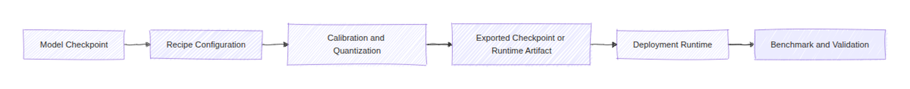
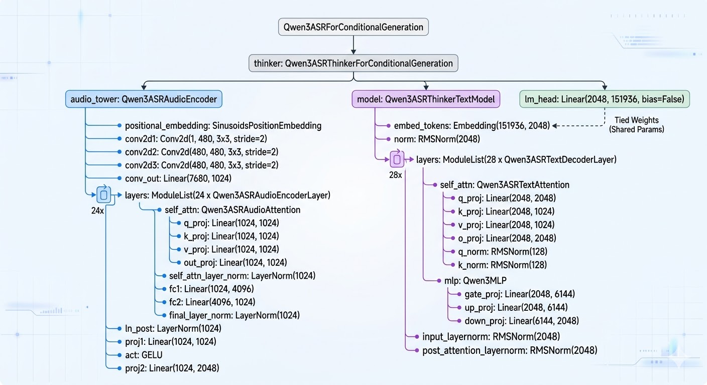

# model-quantization-recipes


Practical quantization recipes for large language models and speech models, from model preparation through deployment-oriented validation.

`model-quantization-recipes` collects reproducible workflows for FP8, NVFP4, AWQ, and TensorRT-based inference. Each recipe is designed as a self-contained engineering reference with its own dependencies, runbook, validation notes, and expected outputs so teams can evaluate and adapt quantization flows with less setup overhead.

## Highlights

- Recipe-oriented structure for repeatable quantization work across LLM and ASR models
- Dedicated optional dependency groups installed with `uv sync --extra <recipe-name>`
- Support for NVIDIA ModelOpt, llmcompressor, Hugging Face export flows, vLLM serving, and TensorRT-oriented deployment paths
- Hardware-aware examples spanning data-center GPUs and edge deployment scenarios
- Documented benchmark results for the Qwen3-ASR optimization workflow

## Overview

The repository currently includes:

| Recipe | Primary scope | Install |
|--------|---------------|---------|
| `recipes/gemma4/` | Generic Gemma4 quantization with NVIDIA ModelOpt and Hugging Face export | `uv sync --extra gemma4` |
| `recipes/qwen3-asr/` | ASR quantization and inference optimization for vLLM, TensorRT-Edge-LLM, and quantization-aware distillation (QAD) | `uv sync --extra qwen3-asr` |
| `recipes/qwen36-27b/` | Universal causal LLM quantization with llmcompressor | `uv sync --extra qwen36-27b` |
| `recipes/qwen36-moe-35b-nvfp4/` | INT8, FP8, and NVFP4 quantization for hybrid MoE models | `uv sync --extra qwen36-moe-35b-nvfp4` |
| `recipes/cosmos-reason2/` | NVFP4 quantization for Cosmos Reason2 (2B, 8B) with llmcompressor and Hugging Face export | `uv sync --extra cosmos-reason2` |

## Architecture



Representative model architecture from the Qwen3-ASR recipe:



Representative TensorRT workflow from the Qwen3-ASR recipe:


## Installation

Install only the dependencies required for the recipe you plan to run:

```bash
uv sync --extra gemma4
uv sync --extra qwen3-asr
uv sync --extra qwen36-27b
uv sync --extra qwen36-moe-35b-nvfp4
uv sync --extra cosmos-reason2
```

## Quick Start

Example: run the Gemma4 quantization flow.

```bash
uv sync --extra gemma4
cd recipes/gemma4
MODEL_PATH=/path/to/gemma4-checkpoint QUANTIZATION=fp8 bash quantize.sh
```

For recipe-specific setup, environment variables, and runtime guidance, use the corresponding recipe README.

## Usage

### Gemma4

```bash
cd recipes/gemma4
python quantize_gemma4.py \
  --model_path /path/to/gemma4-model \
  --output_path /path/to/output \
  --quantization nvfp4 \
  --model_dtype bfloat16
```

### Qwen36 27B

```bash
cd recipes/qwen36-27b
python quantize.py \
  --model_path ./my-model \
  --output_path ./my-model-FP8 \
  --scheme FP8 \
  --max_memory_per_gpu 76
```

### Qwen36 MoE 35B NVFP4

```bash
cd recipes/qwen36-moe-35b-nvfp4
python3 quantize.py \
  --model_path ./model \
  --output_path ./model-fp8 \
  --quant_dtype fp8
```

### Qwen3-ASR

```bash
uv sync --extra qwen3-asr
make -C recipes/qwen3-asr setup-submodules
```

The Qwen3-ASR recipe provides three deployment paths:

- `vllm/` for online HTTP serving on RTX-class systems
- `trt-edgellm/` for on-device edge inference on Jetson Orin Nano
- `llm-qad/` for quantization-aware distillation to recover accuracy post-PTQ

### Cosmos Reason2

```bash
cd recipes/cosmos-reason2

# Quantize 2B model
MODEL_PATH=/path/to/Cosmos-Reason2-2B OUTPUT_PATH=/path/to/output ./quantize.sh

# Quantize 8B model
MODEL_PATH=/path/to/Cosmos-Reason2-8B OUTPUT_PATH=/path/to/output ./quantize.sh
```

## Benchmark and Results

Representative results from `recipes/qwen3-asr/`:

### vLLM on RTX 5090

| Model | WER | RTF | Throughput | Weights |
|-------|-----|-----|------------|---------|
| BF16 | 7.34% | 0.0190 | 15.42 req/s | 3.87 GB |
| FP8 | 7.60% | 0.0152 | 19.37 req/s | 2.55 GB |
| NVFP4 | 10.73% | 0.0186 | 15.77 req/s | 1.99 GB |

### TensorRT-Edge-LLM on Jetson Orin Nano 8 GB

| Format | WER | RTF | Throughput | RAM |
|--------|-----|-----|------------|-----|
| INT8 SmoothQuant | 9.07% | 0.2190 | 1.29 samples/s | 4.2 GB |
| INT4 AWQ | 8.69% | 0.1641 | 1.72 samples/s | 3.3 GB |

For the edge results, Jetson measurements use unified memory while RTX measurements report model weights in VRAM, so memory figures are not directly comparable.

## Project Structure

```text
.
├── pyproject.toml
├── CONTRIBUTING.md
├── recipes/
│   ├── _template/
│   ├── cosmos-reason2/
│   ├── gemma4/
│   ├── qwen3-asr/
│   ├── qwen36-27b/
│   └── qwen36-moe-35b-nvfp4/
└── README.md
```

Each recipe should remain self-contained:

- `README.md`: purpose, hardware, dependencies, runbook, and expected outputs
- `scripts/` or top-level runner scripts: reproducible entrypoints
- `artifacts/` or `runtime/`: example assets when needed
- Root `pyproject.toml`: optional dependency groups for recipe-specific installation

## Adding a Recipe

Use `recipes/_template/README.md` as the baseline for new recipe documentation. Each recipe should document its purpose, dependencies, tested environment, execution steps, and expected outputs.

## Roadmap

- Expand recipe coverage across additional model families and deployment targets
- Continue standardizing validation metadata and reproducible setup instructions
- Add more benchmark summaries as additional recipes mature

## Contributing

See [CONTRIBUTING.md](CONTRIBUTING.md) for contribution requirements, documentation expectations, and review guidance.

## Contributors

- [Quang Nguyen](https://github.com/quangnd-vr)
- [Hung Ho](https://github.com/hungho77)
- [An Thai Le](https://github.com/anindex)

## License

BSD-3-Clause

## References

- [Qwen3-ASR Technical Report](https://arxiv.org/abs/2601.21337)
- [Qwen3-ASR Model](https://huggingface.co/Qwen/Qwen3-ASR-1.7B)
- [NVIDIA ModelOpt Documentation](https://nvidia.github.io/TensorRT-Model-Optimizer/)
- [TensorRT-Edge-LLM Documentation](https://nvidia.github.io/TensorRT-Edge-LLM/0.6.0/developer_guide/getting-started/installation.html)
- [vLLM Documentation](https://docs.vllm.ai)