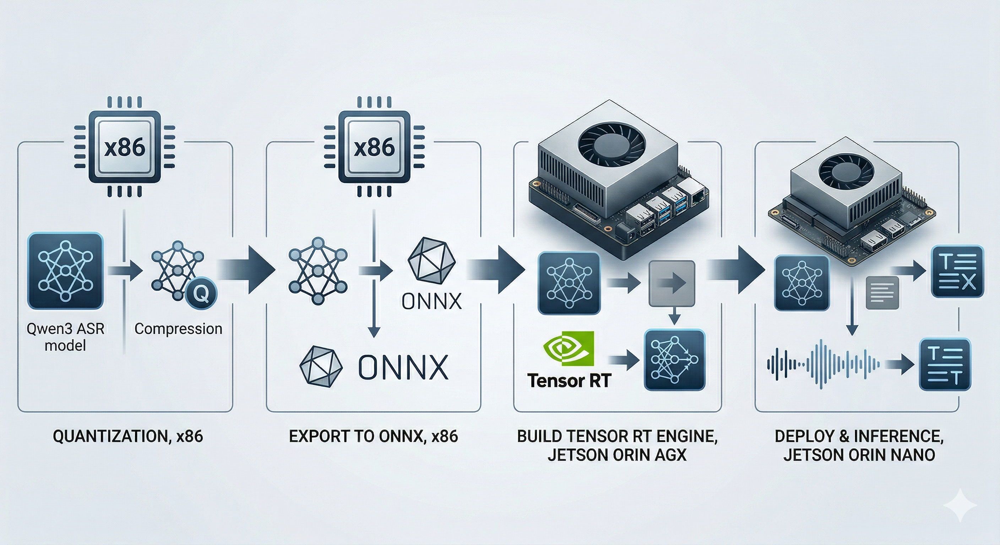
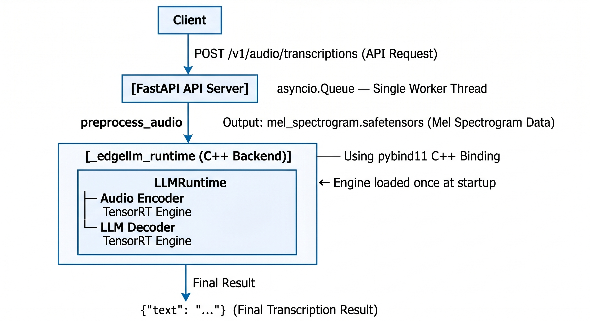

# trt-edgellm — Edge Inference (INT8 / INT4) on Jetson Orin Nano

Deployment pipeline for Qwen3-ASR 1.7B on **Jetson Orin Nano 8 GB**
using [TensorRT-Edge-LLM v0.6.0](https://nvidia.github.io/TensorRT-Edge-LLM/0.6.0/).



---

## Platform Overview

| Stage | Platform | Task |
|-------|----------|------|
| Step 1 — Quantize | x86 (RTX 5090) | PTQ via NVIDIA ModelOpt |
| Step 2 — Export ONNX | x86 | Convert checkpoint → ONNX |
| Step 3 — Build Engines | **Jetson Orin AGX** | Compile TRT engines |
| Step 4 — Inference / Benchmark | **Jetson Orin Nano** | Run on-device |

> **Why build engines on AGX, not Nano?**
> Building TRT engines from the INT8 checkpoint exhausts memory on Jetson Orin
> Nano 8 GB regardless of configuration. Both Orin AGX and Orin Nano share the
> **SM87** architecture, so engines compiled on AGX run correctly on Nano
> without modification.

---

## Prerequisites

### x86 workstation

```bash
# From repo root
uv sync --extra qwen3-asr
make -C recipes/qwen3-asr setup-submodules   # clones external/qwen3_asr

# IMPORTANT: datasets must be pinned to 2.19.0 (already in the qwen3-asr extra)
```

**Download model weights:**
```bash
huggingface-cli download Qwen/Qwen3-ASR-1.7B --local-dir ./Qwen3-ASR-1.7B
```

### Jetson Orin (AGX & Nano)

**Requirements:** JetPack 6.2+, CUDA 12.x, Python 3.10+

**Install TensorRT-Edge-LLM v0.6.0** following the
[official installation guide](https://nvidia.github.io/TensorRT-Edge-LLM/0.6.0/developer_guide/getting-started/installation.html).

> **Important CMake flag:** The official docs use `-DEMBEDDED_TARGET=jetson-thor`.
> For Jetson Orin, change this to **`-DEMBEDDED_TARGET=jetson-orin`**:
> ```bash
> cmake .. \
>     -DCMAKE_BUILD_TYPE=Release \
>     -DTRT_PACKAGE_DIR=/usr \
>     -DCMAKE_TOOLCHAIN_FILE=cmake/aarch64_linux_toolchain.cmake \
>     -DEMBEDDED_TARGET=jetson-orin   # <-- changed from jetson-thor
> ```
> All subsequent build steps remain the same as documented.

**Python dependencies (inference / benchmark on Nano):**
```bash
pip install soundfile tqdm jiwer safetensors
```

---

## INT8 — Required Source Modification Before Building

> **Skip this section for INT4 — proceed directly to Step 3.**

When building TRT engines on AGX for INT8 SmoothQuant, the default builder
optimization level (3) allows TensorRT to select kernels that exploit hardware
features available on AGX but not on Nano. This causes the engine to silently
fail at inference time on Nano.

**Fix:** Set the builder optimization level to **2** so kernel selection is
restricted to tactics supported by both boards.

Reference:
[TensorRT Builder Optimization Level docs](https://docs.nvidia.com/deeplearning/tensorrt/latest/performance/builder-performance.html)

**Files to edit (in the TensorRT-Edge-LLM source, on the machine building the tool):**
```
<trt_edgellm_dir>/cpp/builder/llmBuilder.cpp
<trt_edgellm_dir>/cpp/builder/audioBuilder.cpp
```

In **both** files, locate:
```cpp
auto config = createBuilderConfig(builder.get());
if (!config)
{
    LOG_ERROR("Failed to create builder config");
    return false;
}
```

Add the following line **immediately after** that block:
```cpp
config->setBuilderOptimizationLevel(2);
```

**Rebuild after patching:**
```bash
cd <trt_edgellm_dir>/build
make -j$(nproc)
```

---

## Step 1 — Quantize (x86)

`quantize.py` supports both INT8 SmoothQuant and INT4 AWQ via `--format`.
After saving the checkpoint it automatically patches `config.json` to inject
the six architecture fields required by TensorRT-Edge-LLM
(`hidden_size`, `num_attention_heads`, `num_hidden_layers`,
`num_key_value_heads`, `vocab_size`, `max_position_embeddings`)
into `thinker_config`, immediately before `audio_config`.

**Format reference:**

| Format | `--format` | Config | Notes |
|--------|-----------|--------|-------|
| INT8 SmoothQuant | `int8` | `mtq.INT8_SMOOTHQUANT_CFG` | Weight + activation |
| INT4 AWQ | `int4` | `mtq.INT4_AWQ_CFG` | Activation-aware weight |

```bash
# INT8 SmoothQuant
bash scripts/01_quantize.sh \
    --model_path    /path/to/Qwen3-ASR-1.7B \
    --qwen_asr_root ../external/qwen3_asr \
    --format        int8 \
    --output_dir    ./Qwen3-ASR-1.7B-int8

# INT4 AWQ
bash scripts/01_quantize.sh \
    --model_path    /path/to/Qwen3-ASR-1.7B \
    --qwen_asr_root ../external/qwen3_asr \
    --format        int4 \
    --output_dir    ./Qwen3-ASR-1.7B-int4
```

Or from repo root:
```bash
make trt-quantize-int8  MODEL_PATH=/path/to/Qwen3-ASR-1.7B
make trt-quantize-int4  MODEL_PATH=/path/to/Qwen3-ASR-1.7B
```

---

## Step 2 — Export to ONNX (x86)

```bash
# INT8
bash scripts/02_export_onnx.sh ./Qwen3-ASR-1.7B-int8  ./Qwen3-ASR-1.7B-int8-ONNX

# INT4
bash scripts/02_export_onnx.sh ./Qwen3-ASR-1.7B-int4  ./Qwen3-ASR-1.7B-int4-ONNX
```

Output structure:
```
Qwen3-ASR-1.7B-int8-ONNX/
├── model.onnx           ← LLM thinker
├── config.json          ← patched token IDs
└── audio_encoder/
    └── model.onnx       ← audio encoder (fp16)
```

**Transfer to Jetson Orin AGX:**
```bash
scp -r ./Qwen3-ASR-1.7B-int8-ONNX  <user>@<agx-ip>:~/
```

---

## Step 3 — Build TRT Engines (Jetson Orin AGX)

> For INT8: apply the `setBuilderOptimizationLevel(2)` patch and rebuild
> the tool **before** running this step (see above).

```bash
# INT8
bash scripts/03_build_engine.sh \
    ~/Qwen3-ASR-1.7B-int8-ONNX \
    ~/Qwen3-ASR-1.7B-int8-Engines

# INT4
bash scripts/03_build_engine.sh \
    ~/Qwen3-ASR-1.7B-int4-ONNX \
    ~/Qwen3-ASR-1.7B-int4-Engines
```

Build parameters can be overridden via environment variables:

| Variable | Default | Description |
|----------|---------|-------------|
| `MAX_BATCH_SIZE` | `1` | Maximum inference batch size |
| `MAX_INPUT_LEN` | `1024` | Maximum input token length |
| `MAX_KV_CACHE` | `1024` | Maximum KV cache capacity |
| `MAX_TIME_STEPS` | `1500` | Maximum audio time steps |
| `TRT_MAX_WORKSPACE_SIZE` | `536870912` | TRT workspace in bytes (512 MB) |

**Transfer engines to Jetson Orin Nano:**
```bash
scp -r ~/Qwen3-ASR-1.7B-int8-Engines  <user>@<nano-ip>:~/
```

---

## Step 4a — Single Audio Inference (Jetson Orin Nano)

Transcribe one audio file. Prints only the transcription text.

```bash
python inference.py \
    --audio      /path/to/audio.wav \
    --engine_dir ~/Qwen3-ASR-1.7B-int8-Engines
```

Optional: `--trt_edgellm_dir ~/TensorRT-Edge-LLM`, `--max_generate_length 256`.

---

## Step 4b — Batch Benchmark (Jetson Orin Nano)

Full 4-phase pipeline: preprocess audio → build inference JSON → run inference → compute WER/RTF.

> **Preprocessing note:** Phase 1 converts each `.wav` to SafeTensor format
> using `tensorrt_edgellm.scripts.preprocess_audio`. This is CPU-bound.
> On Jetson Orin Nano (6-core ARM) allow ~10–15 minutes for 760 files.
> Already-processed files are skipped on re-runs.

```bash
# INT8
bash scripts/04_benchmark.sh \
    --audio_dir   /path/to/wav/files \
    --prompts     /path/to/prompts.txt \
    --engine_dir  ~/Qwen3-ASR-1.7B-int8-Engines \
    --work_dir    ./results_int8

# INT4
bash scripts/04_benchmark.sh \
    --audio_dir   /path/to/wav/files \
    --prompts     /path/to/prompts.txt \
    --engine_dir  ~/Qwen3-ASR-1.7B-int4-Engines \
    --work_dir    ./results_int4
```

**`prompts.txt` format** — one utterance per line (tab-separated ID and reference text):
```
VIVOSDEV01_001	xin chao the gioi
VIVOSDEV01_002	hom nay troi dep
```

> This file is an **input** to the benchmark: it provides reference transcriptions
> for WER computation. It is not generated by the pipeline.

**Optional flags:**

| Flag | Default | Description |
|------|---------|-------------|
| `--trt_edgellm_dir` | `~/TensorRT-Edge-LLM` | Path to TRT-EdgeLLM repo |
| `--workers` | `os.cpu_count()` | Parallel workers for preprocessing |
| `--batch_size` | `1` | Inference batch size |
| `--max_generate_length` | `256` | Max output tokens |
| `--temperature` | `0.0` | Sampling temperature |

**Outputs** (saved to `<work_dir>/results/`):

| File | Contents |
|------|----------|
| `detail.tsv` | Per-sample REF / HYP pairs |
| `summary.txt` | WER, RTF, throughput, RAM footprint |

---

## Multilingual WER Note

`benchmark.py` uses a language-agnostic `normalize()` function that handles
all 30 languages supported by Qwen3-ASR. For **character-based scripts**
(Chinese, Cantonese, Japanese) spaces are inserted between characters so that
`jiwer` computes character error rate (CER) rather than word error rate (WER).
Pass `--language chinese` (or the appropriate language name) to activate this
behaviour; default is word-level WER for alphabetic scripts.

---

## Results — Jetson Orin Nano 8 GB

760 VIVOS test samples. BF16 baseline WER: 7.34% (x86 reference).

| Format | WER | RTF | Throughput | RAM |
|--------|-----|-----|-----------|-----|
| INT8 SmoothQuant | 9.07% | 0.2190 | 1.29 samples/s | 4.2 GB |
| INT4 AWQ         | 8.69% | 0.1641 | 1.72 samples/s | 3.3 GB |

---

## Step 5 — Serve Qwen3-ASR (Experimental)

> **Platform note:** Development, initial debugging, and final edge deployment
> for this section were conducted on **Jetson Orin AGX** (Ubuntu 22.04,
> TensorRT-Edge-LLM 0.7.0). The same approach applies to x86 workstations
> with the appropriate CMake flags.

This section wraps the TensorRT engine into a REST API server following the
OpenAI Whisper standard (`POST /v1/audio/transcriptions`), enabling seamless
integration with any Whisper-compatible client.

> **Why a custom server?** TensorRT-Edge-LLM 0.7.0 provides out-of-the-box
> server endpoints for Text-to-Text and Vision-Language models only. Native
> support for ASR pipelines is not yet available, so a custom server was built
> with targeted modifications at the C++ bindings layer.

### System Architecture

To eliminate cold-start latency, the inference engine is loaded into GPU memory
once at startup. Incoming concurrent requests are managed via an
`asyncio.Queue` and processed sequentially by a single worker thread,
following a pattern similar to vLLM.



### Prerequisites

- **Install TensorRT-Edge-LLM v0.7.0** (upgrade from v0.6.0 required):
  [Installation guide](https://nvidia.github.io/TensorRT-Edge-LLM/user_guide/getting_started/installation.html)

- **Build with Python bindings & install server dependencies**:
  [Experimental server setup](https://nvidia.github.io/TensorRT-Edge-LLM/user_guide/examples/experimental-server.html)

### Patching the C++ Bindings

During integration, the model generated text but ignored audio input (e.g.
`{"text": "language None"}`). The root cause: while the C++ struct natively
supports `audioBuffers`, the Python API in v0.7.0 did not expose this
attribute.

**Apply the following patch to
`<trt_edgellm_dir>/experimental/pybind/edgellm_pybind.cpp`:**

```cpp
#include "runtime/audioUtils.h"

// 1. Bind the AudioData struct
py::class_<audioUtils::AudioData>(m, "AudioData")
    .def(py::init<>())
    .def_readwrite("mel_spectrogram_path",   &audioUtils::AudioData::melSpectrogramPath)
    .def_readwrite("mel_spectrogram_format", &audioUtils::AudioData::melSpectrogramFormat);

// 2. Expose audio_buffers on the Request struct
// Locate the binding block for LLMGenerationRequest::Request and insert:
.def_readwrite("audio_buffers", &LLMGenerationRequest::Request::audioBuffers);
```

**Recompile the pybind module after patching:**
```bash
make -j$(nproc) _edgellm_runtime
```

### Running the Server

Configuration is managed entirely via environment variables — no hardcoded
paths in the source.

```bash
ENGINE_DIR=/path/to/Qwen3-ASR-Engines \
EDGELLM_ROOT=/path/to/TensorRT-Edge-LLM \
LD_LIBRARY_PATH=$LD_LIBRARY_PATH:/path/to/TensorRT-Edge-LLM/build \
uvicorn asr_server:app --host 0.0.0.0 --port 8000
```

Replace `Qwen3-ASR-Engines` with the actual engine directory name for your
quantization format, e.g. `Qwen3-ASR-1.7B-int8smoothquant-Engines` or
`Qwen3-ASR-1.7B-int4awqfull-Engines`.

**Optional environment variables:**

| Variable | Default | Description |
|----------|---------|-------------|
| `AUDIO_ENGINE_DIR` | `ENGINE_DIR/audio_encoder` | Path to audio encoder directory |
| `TEMP_DIR` | `/tmp/asr_server` | Working directory for per-request scratch files |
| `WAVES_DIR` | _(unset)_ | Path to a `.wav` file tree; enables `GET /v1/files` and `GET /v1/audio/file` browser endpoints |

> **Performance note:** Audio preprocessing (mel-spectrogram extraction) runs
> in-process rather than spawning a subprocess per request, eliminating
> ~300–800 ms of Python interpreter cold-start overhead on each call.

**Query the endpoint:**
```bash
curl -X POST http://<server-ip>:8000/v1/audio/transcriptions \
  -F "file=@/path/to/audio.wav"
```

**Example response:**
```json
{
  "text": "xin chao the gioi",
  "timings": {
    "preprocess_ms": 42.3,
    "inference_ms": 780.1,
    "total_ms": 822.4
  }
}
```

### Web Demo UI

A lightweight demo interface (`asr_demo.html`) is included for visual testing.
Serve it as a static file from the same machine as the API server:

```bash
# Run from the project directory, on the same machine as the API server
python -m http.server 8080
```

Then open in a browser from any machine on the same network:
```
http://<server-ip>:8080/asr_demo.html
```

The page derives the API base URL from `window.location.hostname`, so it
connects to the correct server automatically regardless of IP address — no
manual configuration required.

The demo UI supports two input modes:
- **File upload** — drag-and-drop or browse any `.wav/.mp3/.flac/.ogg/.m4a`
  file; displays a waveform, pipeline stage timings, and the transcript.
- **Live microphone** — captures audio from any connected mic; VAD detects
  speech automatically and submits for transcription on silence, with no
  manual file handling required.

### Demo

https://github.com/user-attachments/assets/a86a4e0e-83d7-42f0-8556-fcfd7b43afb9

---

## Step 6 — Quantization-Aware Distillation / QAD (Experimental)

Although PTQ algorithms such as SmoothQuant and AWQ are effective at reducing
immediate conversion errors, they are inherently static. When compressing
aggressively to INT4 or INT8, these calibration methods often hit information
capacity limits, resulting in unavoidable accuracy degradation.

To recover accuracy while preserving the latency and memory advantages of
quantization, this pipeline implements a customised **Quantization-Aware
Distillation (QAD)** approach. Rather than stopping at static weight
calibration, QAD actively fine-tunes the fake-quantised computational graph,
allowing the student model to partially recover lost accuracy by approximating
the output distribution of a full-precision teacher — using only unlabelled
audio data.

### Architecture & Workflow



Instead of manually annotated datasets, QAD exploits a raw speech corpus
spanning 30 languages. The distillation process targets only the components
degraded during compression:

**Teacher–Student setup:** The FP16 base model (e.g. Qwen3-ASR-1.7B) is frozen
and serves as the teacher, generating pseudo-labels used as training targets for
the quantised student (e.g. Qwen3-ASR-0.6B pre-initialised via AWQ or
SmoothQuant).

**Targeted freezing:** The `audio_tower` and `lm_head` modules are isolated and
fixed in FP16 to preserve acoustic feature extraction and vocabulary mapping.
Only the fake-quantised QKV/MLP weight matrices are set to a trainable state.

**Custom distillation loss:** Loss is computed exclusively on response tokens
(positions following `<|audio_end|>`), using a linear combination
(`alpha_kd = 0.5`) of:
- KL-divergence loss against the teacher's soft probability distribution
  (`temperature = 2.0`)
- Standard cross-entropy loss against the pseudo-labels

**Distributed training:** The pipeline runs via Distributed Data Parallel (DDP)
with dynamic gradient accumulation. WER on VIVOS and LibriSpeech is computed
automatically at each checkpoint.

### Results (Qwen3-ASR-0.6B)

**Table 1 — INT4 AWQ recovery:**

| Model | VIVOS (vi) WER ↓ | LibriSpeech (en) WER ↓ | Fleurs (zh) CER ↓ |
|-------|-----------------|------------------------|-------------------|
| Qwen3-ASR-1.7B BF16 (reference) | 7.24% | 2.32% | 7.12% |
| INT4 AWQ (pre-QAD baseline) | 14.34% | 3.47% | 8.16% |
| INT4 AWQ + QAD (proposed) | **12.81%** | **3.41%** | **8.10%** |

**Table 2 — INT8 SmoothQuant recovery:**

| Model | VIVOS (vi) WER ↓ | LibriSpeech (en) WER ↓ |
|-------|-----------------|------------------------|
| Qwen3-ASR-0.6B BF16 (reference) | 10.53% | 2.66% |
| INT8 SmoothQuant (pre-QAD baseline) | 11.75% | 2.81% |
| INT8 SmoothQuant + QAD (proposed) | **11.55%** | **2.76%** |

The QAD step recovered ~1.53% absolute WER on the Vietnamese dataset for INT4
AWQ, while maintaining stability across English and Chinese — entirely without
additional labelled data.

### Model Checkpoints

QAD-enhanced checkpoints are publicly available on Hugging Face:

- **Qwen3-ASR-0.6B INT4 AWQ + QAD** — [vrfai/Qwen3-ASR-0.6B-int4-QAD](https://huggingface.co/vrfai/Qwen3-ASR-0.6B-int4-QAD)
- **Qwen3-ASR-0.6B INT8 SmoothQuant + QAD** — [vrfai/Qwen3-ASR-0.6B-int8-QAD](https://huggingface.co/vrfai/Qwen3-ASR-0.6B-int8-QAD)

---

## References

- [TensorRT-Edge-LLM v0.6.0 Installation](https://nvidia.github.io/TensorRT-Edge-LLM/0.6.0/developer_guide/getting-started/installation.html)
- [TensorRT-Edge-LLM v0.7.0 Experimental High-Level Python API and Server](https://nvidia.github.io/TensorRT-Edge-LLM/user_guide/examples/experimental-server.html)
- [TensorRT Builder Optimization Level](https://docs.nvidia.com/deeplearning/tensorrt/latest/performance/builder-performance.html)
- [NVIDIA ModelOpt Documentation](https://nvidia.github.io/TensorRT-Model-Optimizer/)
- [Qwen3-ASR Technical Report](https://arxiv.org/abs/2601.21337)
